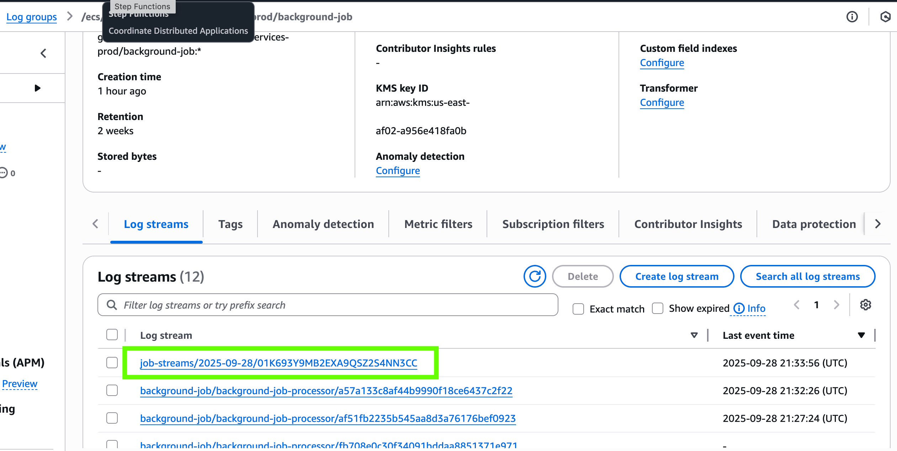
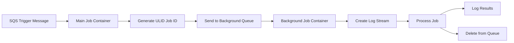

# Message-Driven Microservices on AWS Fargate

This directory contains Terraform configuration to deploy a **pure message-driven microservices architecture** on AWS Fargate with **no HTTP servers**. The system processes messages through SQS queues with comprehensive monitoring and ULID-based job correlation.

## Architecture Overview

### **Pure Message-Driven Design**
- **No HTTP Servers**: Complete elimination of Express.js and HTTP endpoints
- **Queue-to-Queue Processing**: SQS triggers → Main Job → Background Jobs
- **Event-Driven Scaling**: Auto-scale based on queue depth, not HTTP traffic
- **Serverless Containers**: AWS Fargate for zero server management

### **Core Components**
- **Main Job Container**: Polls SQS triggers, processes with ULID correlation
- **Background Job Container**: Long-polling SQS processor with job-specific logging
- **Amazon SQS**: Input triggers queue + Background jobs queue + Dead Letter Queues
- **ECR**: Container image registry with vulnerability scanning
- **CloudWatch**: Job-specific log streams with ULID-based correlation
- **KMS**: End-to-end encryption for logs and messages

### **Example Log Stream Output**



*Example of ULID-based job-specific log streams in CloudWatch, showing how background jobs create dedicated log streams with correlation tracking.*

## 📁 File Structure

```
tf/
├── main.tf                           # Provider configuration and locals
├── variables.tf                      # Input variables
├── security.tf                       # IAM roles, policies, security groups
├── ecr.tf                           # ECR repositories (main-job + background-job)
├── cloudwatch.tf                    # CloudWatch logs, metrics, alarms
├── ecs.tf                           # ECS cluster, task definitions, services
├── sqs.tf                           # SQS queues (triggers + background + DLQs)
├── outputs.tf                       # Output values
├── terraform.tfvars                 # Production configuration
├── Dockerfile.message-driven        # Main job message processor container
├── Dockerfile.background-job-pure   # Background job processor container
├── main-job/
│   ├── message-driven-main.js       # Pure SQS message processor (no HTTP)
│   └── package.json                 # Dependencies (SQS, ULID, CloudWatch)
├── background-job/
│   ├── processor.js                 # SQS job processor with ULID logging
│   └── package.json                 # Background job dependencies
├── DEPLOYMENT_SUCCESS.md            # Deployment summary and testing guide
├── CLEANUP_SUMMARY.md               # Architecture cleanup documentation
└── README.md                        # This file
```

## 🚀 Quick Start

### Prerequisites

1. **Install required tools:**
   ```bash
   # Terraform (https://www.terraform.io/downloads)
   brew install terraform
   
   # AWS CLI (https://aws.amazon.com/cli/)
   brew install awscli
   
   # Docker (https://www.docker.com/get-started)
   brew install docker
   ```

2. **Configure AWS credentials:**
   ```bash
   aws configure
   ```

### Deployment

1. **Deploy the infrastructure:**
   ```bash
   terraform init
   terraform plan
   terraform apply -auto-approve
   ```

2. **Build and push container images:**
   ```bash
   # Login to ECR
   aws ecr get-login-password --region us-east-1 | docker login --username AWS --password-stdin <account-id>.dkr.ecr.us-east-1.amazonaws.com
   
   # Build and push main job container
   docker build --platform=linux/amd64 -f Dockerfile.message-driven -t <ecr-main-job-url>:latest .
   docker push <ecr-main-job-url>:latest
   
   # Build and push background job container
   docker build --platform=linux/amd64 -f Dockerfile.background-job-pure -t <ecr-background-job-url>:latest .
   docker push <ecr-background-job-url>:latest
   ```

3. **Test your message-driven system:**
   ```bash
   # Send a test message to trigger processing
   aws sqs send-message \
     --queue-url <main-job-triggers-queue-url> \
     --message-body '{"trigger":"test","timestamp":"'$(date -u +%Y-%m-%dT%H:%M:%S.%3NZ)'","triggerBackgroundJob":true}'
   ```

## Message-Driven Processing

### System Components

1. **Main Job Container** (`main-job/message-driven-main.js`)
   - Pure SQS message processor (no HTTP server)
   - Long-polling input trigger queue
   - Conditional background job queuing
   - ULID-based job ID generation

2. **SQS Queue System**
   - **Trigger Queue**: `message-driven-microservices-prod-main-job-triggers`
   - **Background Queue**: `message-driven-microservices-prod-background-jobs`  
   - **Dead Letter Queues**: Automatic retry with DLQ for failed jobs
   - **Long Polling**: Reduces API calls and improves efficiency

3. **Background Job Container** (`background-job/processor.js`)
   - Long-polling SQS message consumption
   - Job-specific CloudWatch log streams  
   - ULID-based job correlation tracking
   - Enhanced error handling and retries

### Message Processing Architecture

```
External System → Trigger Queue → Main Job Container → Background Queue → Background Job Container
                       ↓                    ↓                  ↓                    ↓
                   Monitoring          Processing         Queuing            Processing
                   & Alerting         + ULID Gen        + Routing         + Logging
```

### Job Processing Flow



### CloudWatch Job Logging

Each background job creates a dedicated log stream:
- **Format**: `job-streams/YYYY-MM-DD/{ULID-JOB-ID}`
- **Content**: Job start, processing steps, completion/error status
- **Searchable**: Filter by job ID across all log entries

### Creating Custom Log Streams

If you want to create your own custom log streams for specific purposes, you can modify the CloudWatch logging configuration:

#### 1. **Add Custom Log Stream in Code**

In your application code (`background-job/processor.js` or `main-job/message-driven-main.js`):

```javascript
const AWS = require('aws-sdk');
const { ulid } = require('ulid');

const cloudwatchlogs = new AWS.CloudWatchLogs({
  region: process.env.AWS_REGION || 'us-east-1'
});

async function createCustomLogStream(logGroupName, customStreamName) {
  try {
    await cloudwatchlogs.createLogStream({
      logGroupName: logGroupName,
      logStreamName: customStreamName
    }).promise();
    
    console.log(`Created custom log stream: ${customStreamName}`);
  } catch (error) {
    if (error.code !== 'ResourceAlreadyExistsException') {
      console.error('Error creating log stream:', error);
    }
  }
}

// Example usage for custom streams
const customStreamName = `custom-streams/${new Date().toISOString().split('T')[0]}/${ulid()}`;
await createCustomLogStream('/ecs/message-driven-microservices-prod/background-job', customStreamName);
```

#### 2. **Add Custom Log Groups via Terraform**

Add to your `cloudwatch.tf` file:

```hcl
# Custom log group for special processing
resource "aws_cloudwatch_log_group" "custom_processing" {
  name              = "/ecs/${local.project_name}/custom-processing"
  retention_in_days = var.log_retention_days
  kms_key_id        = aws_kms_key.cloudwatch_logs.arn

  tags = local.common_tags
}

# Custom log stream (optional - can be created programmatically)
resource "aws_cloudwatch_log_stream" "custom_stream_example" {
  name           = "custom-example-stream"
  log_group_name = aws_cloudwatch_log_group.custom_processing.name
}
```

#### 3. **Environment-Specific Log Streams**

For different environments or processing types:

```javascript
// Create environment-specific streams
const streamPatterns = {
  error: `error-streams/${date}/${jobId}`,
  audit: `audit-streams/${date}/${jobId}`, 
  performance: `perf-streams/${date}/${jobId}`,
  debug: `debug-streams/${date}/${jobId}`
};

// Usage example
await createCustomLogStream(logGroupName, streamPatterns.error);
await logToCustomStream(streamPatterns.error, {
  level: 'ERROR',
  jobId: jobId,
  error: errorDetails,
  timestamp: new Date().toISOString()
});
```

#### 4. **Update IAM Permissions**

Ensure your ECS task role has permission to create custom log streams by updating `security.tf`:

```hcl
resource "aws_iam_role_policy" "custom_logging" {
  name = "${local.project_name}-${var.environment}-custom-logging"
  role = aws_iam_role.ecs_task_role.id

  policy = jsonencode({
    Version = "2012-10-17"
    Statement = [
      {
        Effect = "Allow"
        Action = [
          "logs:CreateLogStream",
          "logs:PutLogEvents",
          "logs:DescribeLogStreams",
          "logs:DescribeLogGroups"
        ]
        Resource = [
          "${aws_cloudwatch_log_group.custom_processing.arn}*",
          "arn:aws:logs:${var.aws_region}:${data.aws_caller_identity.current.account_id}:log-group:/ecs/${local.project_name}/*"
        ]
      }
    ]
  })
}
```

#### 5. **Query Custom Log Streams**

```bash
# List all custom log streams
aws logs describe-log-streams \
  --log-group-name "/ecs/message-driven-microservices-prod/custom-processing" \
  --order-by LastEventTime --descending

# Search custom logs by pattern
aws logs filter-log-events \
  --log-group-name "/ecs/message-driven-microservices-prod/custom-processing" \
  --filter-pattern "ERROR" \
  --start-time $(date -d "1 hour ago" +%s)000

# Tail custom log streams
aws logs tail "/ecs/message-driven-microservices-prod/custom-processing" --follow
```

**Note**: Custom log streams are automatically created when you first write to them, but explicitly creating them gives you better control over naming and organization.

#### 6. **Tradeoffs for Custom Log Stream IDs**

Before implementing custom log streams, consider these tradeoffs:

##### ✅ **Advantages of Custom Log Stream IDs**

**Business Logic Organization:**
```javascript
// Custom patterns for different job types
const streamName = `${jobType}/${environment}/${date}/${jobId}`;
// Example: payment-processing/prod/2025-09-28/01HK690...
```

**Enhanced Searchability:**
```bash
# Find all payment processing logs
aws logs describe-log-streams --log-group-name "/ecs/app/background-job" \
  --log-stream-name-prefix "payment-processing"
```

**Logical Grouping:**
```javascript
const customPatterns = {
  critical: `critical-jobs/${date}/${jobId}`,
  batch: `batch-processing/${date}/${batchId}/${jobId}`,
  user: `user-actions/${userId}/${date}/${jobId}`
};
```

**Compliance & Auditing:**
```javascript
// Separate streams for audit trails
const auditStream = `audit/${department}/${date}/${jobId}`;
const complianceStream = `compliance/${regulationType}/${date}/${jobId}`;
```

##### ❌ **Disadvantages of Custom Log Stream IDs**

**Increased Complexity:**
```javascript
// More logic needed for stream naming
function generateCustomStreamName(jobType, priority, userId, jobId) {
  const date = new Date().toISOString().split('T')[0];
  return `${jobType}/${priority}/${userId}/${date}/${jobId}`;
}
```

**Higher CloudWatch Costs:**
- More log streams = higher ingestion costs
- Each stream has overhead regardless of size
- More API calls for stream creation

**Stream Limits:**
```
CloudWatch Limits:
- 1,000,000 log streams per log group
- Custom patterns can hit limits faster
- Need rotation strategy for high-volume apps
```

**Debugging Complexity:**
```bash
# Harder to find logs without knowing exact pattern
# Current: just search by jobId
# Custom: need to know jobType + other parameters
```

##### 🎯 **Recommended Hybrid Approach**

Best of both worlds - reliable default with custom options:

```javascript
async function createJobLogStream(jobId, jobType = 'default', options = {}) {
    const now = new Date();
    const dateString = now.toISOString().split('T')[0];
    
    // Default ULID-based pattern (reliable)
    const defaultStream = `job-streams/${dateString}/${jobId}`;
    
    // Custom pattern (optional)
    const customStream = options.customPattern 
        ? `${options.customPattern}/${dateString}/${jobId}`
        : null;
    
    // Try custom first, fallback to default
    const streamName = customStream || defaultStream;
    
    try {
        await createLogStream(streamName);
        return streamName;
    } catch (error) {
        if (customStream && error.name === 'InvalidParameterException') {
            console.warn(`Custom stream failed, using default: ${defaultStream}`);
            await createLogStream(defaultStream);
            return defaultStream;
        }
        throw error;
    }
}

// Usage examples
await createJobLogStream(jobId); // Default ULID pattern
await createJobLogStream(jobId, 'payment', { customPattern: 'critical-jobs' });
await createJobLogStream(jobId, 'batch', { customPattern: `user-${userId}` });
```

##### 🏆 **When to Use Custom Log Stream IDs**

**✅ Use Custom When:**
- **Compliance requirements** (separate audit trails)
- **Multi-tenant systems** (isolate customer data)
- **Critical vs non-critical** job separation
- **Business domain separation** (payments, orders, users)
- **Low to medium volume** applications

**❌ Stick with ULID When:**
- **High-volume applications** (>10k jobs/hour)
- **Simple debugging needs** (just trace by job ID)
- **Cost-sensitive environments**
- **MVP/prototype phases**
- **Single-tenant applications**

##### 💡 **Recommendation for This Project**

For this serverless job queue, **stick with the ULID-based approach** because:

1. **Simplicity**: Easy to find logs by job ID
2. **Cost-effective**: Minimal stream proliferation
3. **Reliable**: ULID ensures uniqueness
4. **Scalable**: Works at any volume
5. **CloudWatch-friendly**: Chronological ordering

**Add custom streams only when you have specific business requirements** that justify the additional complexity and cost.

### Testing the Message-Driven System

1. **Send Trigger Message:**
   ```bash
   # Get queue URL from terraform output
   TRIGGER_QUEUE=$(terraform output -raw sqs_main_job_triggers_queue_url)
   
   # Send test message
   aws sqs send-message \
     --queue-url $TRIGGER_QUEUE \
     --message-body '{
       "trigger": "api_call",
       "timestamp": "'$(date -u +%Y-%m-%dT%H:%M:%S.%3NZ)'",
       "triggerBackgroundJob": true,
       "data": {"userId": "test123", "action": "process_data"}
     }'
   ```

2. **Monitor Message Processing:**
   ```bash
   # Watch main job logs
   aws logs tail /ecs/message-driven-microservices-prod/main-job --follow
   
   # Watch background job logs  
   aws logs tail /ecs/message-driven-microservices-prod/background-job --follow
   ```

3. **Check Queue Metrics:**
   ```bash
   # Check messages in background queue
   aws sqs get-queue-attributes \
     --queue-url $(terraform output -raw sqs_background_jobs_queue_url) \
     --attribute-names ApproximateNumberOfMessages
   ```

4. **View Job-Specific Log Streams:**
   ```bash
   # List log streams with ULID pattern
   aws logs describe-log-streams \
     --log-group-name /ecs/message-driven-microservices-prod/background-job \
     --order-by LastEventTime --descending
   ```

## ⚙️ Configuration

### Key Variables in `terraform.tfvars`

```hcl
# Project Configuration
project_name = "message-driven-microservices"
environment  = "prod"
aws_region   = "us-east-1"

# Container Configuration (No ports needed for message-driven)
container_port   = 0        # Not used in message-driven architecture
container_cpu    = 256      # 0.25 vCPU per container
container_memory = 512      # 512 MB per container  
desired_count    = 1        # Number of tasks per service

# CloudWatch Configuration
log_retention_days = 14     # Log retention period
```

### Scaling Configuration

Scale your message-driven services based on queue depth:

```bash
# Scale main job service
aws ecs update-service \
  --cluster message-driven-microservices-prod-cluster \
  --service message-driven-microservices-prod-main-job-service \
  --desired-count 3

# Scale background job service
aws ecs update-service \
  --cluster message-driven-microservices-prod-cluster \
  --service message-driven-microservices-prod-background-job-service \
  --desired-count 5
```

Then apply changes:
```bash
terraform apply
```

## 📊 Monitoring and Logging

### CloudWatch Log Groups

1. **ECS Task Logs**: `/ecs/message-driven-microservices-prod`
   - Standard container output
   - Application startup logs
   - Health check status

2. **Main Job Logs**: `/ecs/message-driven-microservices-prod/main-job`
   - Message processing logs
   - ULID correlation tracking
   - SQS polling and processing status

3. **Background Job Logs**: `/ecs/message-driven-microservices-prod/background-job`
   - Job-specific log streams with ULID job IDs
   - Format: `job-streams/YYYY-MM-DD/{jobId}`  
   - Detailed job processing with correlation tracking

### CloudWatch Alarms

- **High Error Rate**: Triggers when error count > 5 in 5 minutes
- **High CPU Usage**: Triggers when CPU > 80% for 10 minutes  
- **High Memory Usage**: Triggers when memory > 80% for 10 minutes
- **SQS Queue Depth**: Triggers when background queue > 50 messages
- **DLQ Messages**: Triggers when messages appear in dead letter queues

### Log Stream Examples

**Main Job Container Logs:**
```
/ecs/message-driven-microservices-prod/main-job/main-job/abc123...
```

**Background Job Container Logs:**
```  
/ecs/message-driven-microservices-prod/background-job/background-job-processor/def456...
```

**Job-Specific Log Streams:**
```
job-streams/2025-09-28/01K690MYMZVQF3DYE4HNEZ0HBX
```

**Job Log Content Example:**
```json
{
  "jobId": "01K690MYMZVQF3DYE4HNEZ0HBX",
  "level": "INFO", 
  "message": "Processing background job: main-job-processing",
  "timestamp": "2025-09-28T20:36:24.351Z",
  "correlationId": "synthetic-01K690MYMXH2GT14QZZCWD8HFB"
}
```

## 🏛️ Message-Driven Architecture

### Service Communication Flow

```
┌─────────────────┐   Message   ┌─────────────────┐   Message   ┌──────────────────┐
│ External System │ ──────────► │ Main Job        │ ──────────► │ Background Job   │
│ (API/Events)    │             │ Container       │             │ Container        │
└─────────────────┘             │ (Message Poll)  │             │ (Message Poll)   │
                                └─────────────────┘             └──────────────────┘
                                         │                               │
                                         ▼                               ▼                               │
                  ┌─────────────────────┐       ┌─────────────────────┐
                  │   Trigger Queue     │       │ Background Queue    │  
                  │ (Long Poll Input)   │       │ (Job Processing)    │
                  └─────────────────────┘       └─────────────────────┘
                           │                             │
                           ▼                             ▼
                  ┌─────────────────────┐       ┌─────────────────────┐
                  │  CloudWatch Logs    │       │  CloudWatch Logs    │
                  │  (Main Job)         │       │  (Background Job)   │
                  └─────────────────────┘       └─────────────────────┘
```

### AWS Services Used

- **ECS Fargate**: Serverless containers for message processing (no HTTP servers)
- **Amazon SQS**: Dual-queue system (triggers + background jobs) with DLQs
- **CloudWatch Logs**: Job-specific logging with ULID correlation
- **ECR**: Container registry with automated vulnerability scanning  
- **KMS**: End-to-end encryption for logs and messages
- **IAM**: Service-specific roles with minimal required permissions

### Container Architecture

1. **Main Job Container** (`message-driven-microservices-main-job:latest`)
   - Pure SQS message processor (no HTTP server)
   - Long-polling trigger queue consumer
   - ULID generation and job correlation
   - Conditional background job queuing

2. **Background Job Container** (`message-driven-microservices-background-job:latest`)
   - Dedicated background job processor
   - Job-specific CloudWatch log stream creation
   - Enhanced error handling and retry logic
   - Non-root user security model

## 🔒 Security Features

- **No Network Exposure**: Pure message-driven, no HTTP ports exposed
- **VPC Isolation**: All containers run in default VPC with security groups
- **KMS Encryption**: All logs and SQS messages encrypted at rest
- **ECR Image Scanning**: Automated vulnerability scanning on push
- **IAM Least Privilege**: Service-specific roles with minimal permissions
- **SQS Access Control**: Queue policies restrict access to authorized tasks
- **Container Security**: Non-root users in production containers

## 🛠️ Management Commands

```bash
# Deploy infrastructure
terraform init
terraform apply

# Build and push containers
docker build --platform=linux/amd64 -f Dockerfile.message-driven -t <ecr-url>:latest .
docker push <ecr-url>:latest

# Force service update (rolling deployment)
aws ecs update-service --cluster <cluster> --service <service> --force-new-deployment

# Show deployment information
./deploy.sh info

# Destroy all resources
./deploy.sh destroy
```

## 📈 Scaling and Performance

### Vertical Scaling (Per Task)

Modify in `terraform.tfvars`:
```hcl
container_cpu    = 512      # 0.5 vCPU (256, 512, 1024, 2048, 4096)
container_memory = 1024     # 1GB (512-30720, based on CPU)
```

### Horizontal Scaling (Task Count)

```hcl
desired_count = 5  # Run 5 instances
```

### Auto Scaling (Optional Enhancement)

You can add auto scaling by including:
```hcl
# In ecs.tf
resource "aws_appautoscaling_target" "ecs_target" {
  max_capacity       = 10
  min_capacity       = 1
  resource_id        = "service/${aws_ecs_cluster.main.name}/${aws_ecs_service.app.name}"
  scalable_dimension = "ecs:service:DesiredCount"
  service_namespace  = "ecs"
}
```

## 🔍 Troubleshooting

### Check Services Status
```bash
# Check both service statuses
aws ecs describe-services \
  --cluster $(terraform output -raw ecs_cluster_name) \
  --services $(terraform output -raw ecs_main_job_service_name) $(terraform output -raw ecs_background_job_service_name)
```

### Check Task Health
```bash
aws ecs describe-tasks --cluster $(terraform output -raw ecs_cluster_name) --tasks $(aws ecs list-tasks --cluster $(terraform output -raw ecs_cluster_name) --service-name $(terraform output -raw ecs_service_name) --query 'taskArns[0]' --output text)
```

### Monitor Container Logs  
```bash
# Main job container logs
aws logs tail $(terraform output -raw cloudwatch_log_group_main_job) --follow

# Background job container logs
aws logs tail $(terraform output -raw cloudwatch_log_group_background_job) --follow

# ECS task logs
aws logs tail $(terraform output -raw cloudwatch_log_group_ecs) --follow
```

### Monitor SQS Queues
```bash
# Check trigger queue depth
aws sqs get-queue-attributes \
  --queue-url $(terraform output -raw sqs_main_job_triggers_queue_url) \
  --attribute-names ApproximateNumberOfMessages

# Check background job queue depth  
aws sqs get-queue-attributes \
  --queue-url $(terraform output -raw sqs_background_jobs_queue_url) \
  --attribute-names ApproximateNumberOfMessages

# Check dead letter queues
aws sqs get-queue-attributes \
  --queue-url $(terraform output -raw sqs_main_job_triggers_dlq_url) \
  --attribute-names ApproximateNumberOfMessages
```

## 💰 Cost Optimization

- **Fargate Spot**: 70% cost savings enabled in capacity providers
- **Auto Scaling**: Scale to zero during low message volume
- **Log Retention**: 14-day retention (adjustable based on needs)
- **Resource Right-Sizing**: 256 CPU / 512 MB memory optimized for message processing
- **SQS Long Polling**: Reduces API costs with 20-second wait times

## 🎯 Key Benefits Achieved

✅ **Zero HTTP Overhead**: Pure message-driven, no server ports  
✅ **Horizontal Auto-Scaling**: Scale based on queue depth, not traffic  
✅ **Fault Tolerance**: Dead letter queues and retry mechanisms  
✅ **Cost Efficiency**: Fargate Spot + auto-scaling + long polling  
✅ **Observability**: Complete logging and monitoring with ULID correlation  
✅ **Security**: Encrypted, least-privilege, container-based architecture  

## 🧹 Cleanup

To remove all resources:
```bash
terraform destroy -auto-approve
```

## � Deployment Status

### ✅ Successfully Deployed Infrastructure

Your message-driven microservices are now running on AWS:

- **ECS Cluster**: `message-driven-microservices-prod-cluster`
- **Main Job Service**: `message-driven-microservices-prod-main-job-service`  
- **Background Job Service**: `message-driven-microservices-prod-background-job-service`
- **SQS Queues**: Trigger queue + Background queue + DLQs
- **CloudWatch**: Complete monitoring and alerting
- **ECR**: Container images pushed and ready

### 🔗 Quick Links

- [ECS Console](https://us-east-1.console.aws.amazon.com/ecs/v2/clusters/message-driven-microservices-prod-cluster)
- [SQS Console](https://us-east-1.console.aws.amazon.com/sqs/v2/home?region=us-east-1)  
- [CloudWatch Logs](https://us-east-1.console.aws.amazon.com/cloudwatch/home?region=us-east-1#logsV2:log-groups)

### 📋 Next Steps

1. **Test the system** by sending SQS messages
2. **Monitor performance** in CloudWatch
3. **Set up alerts** via SNS subscriptions
4. **Scale services** based on queue metrics

## �🔄 CI/CD Integration

For automated deployments, integrate with your CI/CD pipeline:

```yaml
# Example GitHub Actions workflow
- name: Deploy Message-Driven Microservices
  run: |
    cd tf
    terraform init
    terraform apply -auto-approve
    
    # Build and push containers
    docker build --platform=linux/amd64 -f Dockerfile.message-driven -t $ECR_MAIN_URL:latest .
    docker push $ECR_MAIN_URL:latest
    ./deploy.sh build
    ./deploy.sh update
```

## 📚 Additional Resources

- [AWS Fargate Documentation](https://docs.aws.amazon.com/AmazonECS/latest/userguide/what-is-fargate.html)
- [Terraform AWS Provider](https://registry.terraform.io/providers/hashicorp/aws/latest/docs)
- [CloudWatch Logs Documentation](https://docs.aws.amazon.com/AmazonCloudWatch/latest/logs/)
- [ECS Service Documentation](https://docs.aws.amazon.com/AmazonECS/latest/userguide/ecs_services.html)
